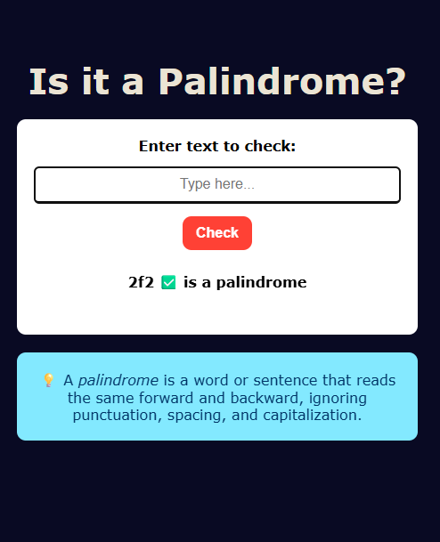

# 📝 Palindrome Checker

A simple, responsive web app that checks if the entered text is a **palindrome** — a word, phrase, or sentence that reads the same backward and forward, ignoring spaces, punctuation, and capitalization.

 screenshot -->

---

## 🚀 Live Demo
👉 [View the live app on GitHub Pages](#) https://stabat47.github.io/Palindrome-checker/

---

## ✨ Features
- ✅ **Real-time palindrome check** by button click or pressing **Enter**  
- ✅ **Responsive design** — adapts perfectly to desktops, tablets, and mobile devices  
- ✅ **Interactive UI** with hover effects and instant results  
- ✅ **Accessible** with keyboard support and `aria-live` updates  
- ✅ **Clean and modern look** with mobile-friendly layout  

---

## 🛠️ Technologies Used
- **HTML5** – semantic structure  
- **CSS3** – responsive and styled interface  
- **JavaScript (Vanilla JS)** – core palindrome logic  

---

## 📂 Project Structure

Palindrome-Checker/
│
├── index.html      # Main HTML file
├── styles.css      # Stylesheet for styling
├── script.js       # JavaScript logic
└── README.md       # Project documentation

## 📖 How to Use
1. Type a word or sentence in the input field.
2. Click the **Check** button or press **Enter**.
3. The app will display whether it **is** or **is not** a palindrome.

## 🖥️ Responsive Design  
The project adjusts seamlessly to all screen sizes:  

- 📱 **Mobile-friendly**  
- 💻 **Tablet and desktop-friendly**  

---

## 💡 About Palindromes  
A palindrome is a word or sentence that reads the same forwards and backwards.  

**Example:**  
- `racecar` ✅ palindrome  
- `hello` ❌ not a palindrome  

---

## 🙌 Acknowledgements  
Inspired by **[freeCodeCamp](https://www.freecodecamp.org/)** JavaScript project challenges.
